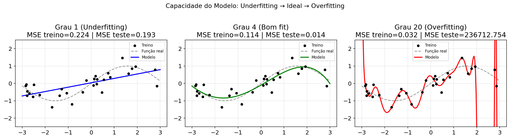
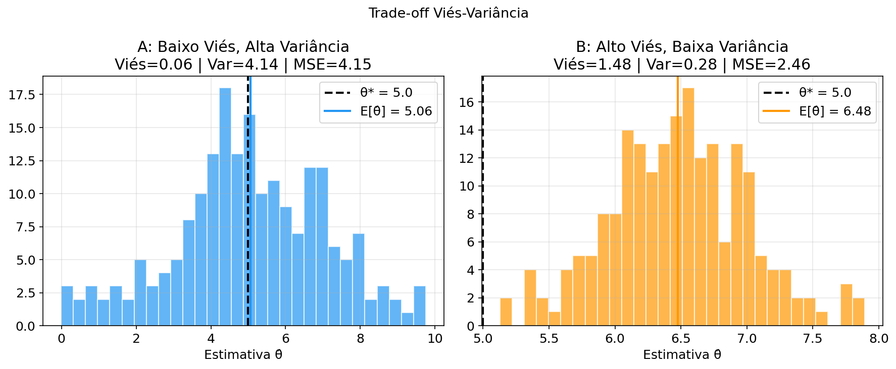
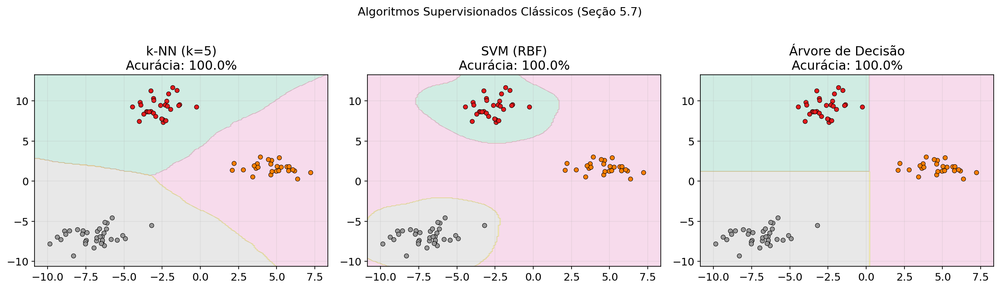
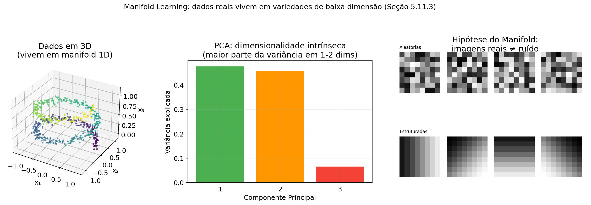

# Neural Networks for Differential Equations

Study material and implementations from the **Neural Networks for ODEs/PDEs** course — PhD in Computational Modeling (PPGMC/UESC).

> **Reference:** Goodfellow, Bengio & Courville. *Deep Learning*, Ch. 5 — Machine Learning Basics (2016, MIT Press)

## Highlights

### Underfitting → Ideal Fit → Overfitting
Polynomial regression on `sin(x)` with degrees 1, 4, and 20 — demonstrating the capacity trade-off.



### Bias-Variance Trade-off
Decomposing MSE into bias² and variance across model complexity.



### Supervised Learning Algorithms
Decision boundaries for k-NN, SVM (RBF), and Decision Tree on a 3-class problem.



### Manifold Learning
3D helix data living on a 1D manifold — PCA reveals intrinsic dimensionality.



## All Topics Covered

| # | Topic | Plot |
|---|-------|------|
| 1 | Linear Regression + MSE optimization | [01](assets/01_linear_regression_mse.png) |
| 2 | Underfitting vs Overfitting | [03](assets/03_underfitting_overfitting.png) |
| 3 | L2 Regularization (Ridge) | [04](assets/04_regularization_l2.png) |
| 4 | Validation Sets | [05](assets/05_validation_sets.png) |
| 5 | Bias-Variance Trade-off | [06](assets/06_bias_variance_tradeoff.png) |
| 6 | MLE: Gaussian convergence | [08](assets/08_mle_gaussian_convergence.png) |
| 7 | MLE ≡ KL Divergence ≡ Cross-Entropy | [09](assets/09_mle_kl_crossentropy.png) |
| 8 | Bayesian Updating | [10](assets/10_bayesian_updating.png) |
| 9 | MAP ≡ L2 Regularization | [11](assets/11_map_vs_mle.png) |
| 10 | Supervised Algorithms (k-NN, SVM, Tree) | [12](assets/12_supervised_algorithms.png) |
| 11 | Supervised vs Unsupervised | [13](assets/13_supervised_vs_unsupervised.png) |
| 12 | Stochastic Gradient Descent | [14](assets/14_sgd_optimization.png) |
| 13 | Curse of Dimensionality | [15](assets/15_curse_of_dimensionality.png) |
| 14 | Manifold Learning + PCA | [16](assets/16_manifold_learning.png) |

## Connection to PINNs

All concepts above apply directly to **Physics-Informed Neural Networks** (the core topic of this PhD course):

- The **model** is a neural network that approximates the solution of an ODE/PDE
- The **loss function** combines the differential equation residual with boundary conditions — MLE of the residual + physics-based regularization
- **Overfitting** can occur when the network memorizes training points but violates the physics
- The **manifold hypothesis** is especially relevant: PDE solutions live on low-dimensional manifolds in function space
- Deep learning overcomes the **curse of dimensionality** that limits classical numerical methods (FEM, FDM) in high dimensions

## Project Structure

```
.
├── assets/                  # Generated plots from the notebook
├── notebooks/
│   └── ml_basics.ipynb      # Full ML fundamentals notebook (16 visualizations)
├── scripts/
│   ├── ajuste-curva.py      # Curve fitting examples
│   ├── autograd.py          # Automatic differentiation with PyTorch
│   ├── pytorch_test.py      # PyTorch installation test
│   └── tensores.py          # Tensor operations
├── pytorch_guia_estudo.md   # Complete PyTorch study guide (basics → PINNs)
└── README.md
```

## Stack

Python 3.9+ · PyTorch 2.x (CUDA 12.1) · NumPy · Pandas · Scikit-learn · SciPy · Matplotlib

## Setup

```bash
python -m venv venv
source venv/bin/activate  # Linux/Mac
# venv\Scripts\activate   # Windows

pip install torch torchvision --index-url https://download.pytorch.org/whl/cu121
pip install numpy matplotlib scikit-learn scipy jupyter ipykernel
```

## References

- Goodfellow, I., Bengio, Y., Courville, A. (2016). *Deep Learning*, Ch. 5. MIT Press.
- Raissi, M. et al. (2019). *Physics-informed neural networks.* Journal of Computational Physics.
- [PyTorch Documentation](https://pytorch.org/docs/stable/)
- [DeepXDE](https://deepxde.readthedocs.io/) — High-level library for PINNs